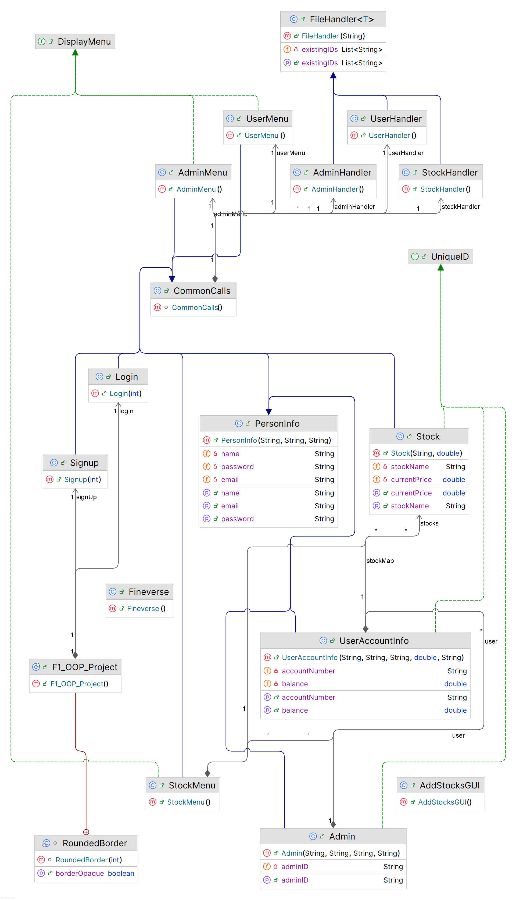

# Finverse - FinTech Management System

Finverse is a robust, Java-based Desktop Application designed to simplify financial management and stock trading. Built using Object-Oriented Programming (OOP) principles and a Swing-based Graphical User Interface (GUI), it provides a seamless experience for both administrators and regular users to manage accounts and investments.

## 🚀 Features

### For Users
- **Secure Authentication**: Login and Signup functionality with unique User IDs.
- **Account Management**: View and update personal and account information.
- **Stock Portfolio**: Browse available stocks and manage personal investments.
- **Interactive UI**: User-friendly dashboard for easy navigation.

### For Administrators
- **Admin Dashboard**: Specialized tools for system-wide management.
- **Stock Control**: Add, update, and manage stock listings in the system.
- **User Oversight**: Manage user accounts and system integrity.
- **Secure Access**: Dedicated admin login credentials.

## 🛠️ Tech Stack

- **Language**: Java 22
- **UI Framework**: Java Swing & AWT
- **Build Tool**: Maven
- **Data Persistence**: Binary Serialization (File-based storage)

## 📁 Project Structure

```text
src/main/java/com/mycompany/f1_oop_project/
├── F1_OOP_Project.java    # Main Entry Point
├── Admin.java             # Admin Model
├── UserAccountInfo.java   # User Model
├── Stock.java             # Stock Model
├── FileHandler.java       # Generic File Management
├── Login/Signup.java      # Authentication Logic
└── GUI Classes            # Swing Implementation
```

## 🧩 System Design

### Class Diagram
Below is the class diagram of the FinVerse system:



## ⚙️ Installation & Setup

1.  **Prerequisites**:
    - Java Development Kit (JDK) 22 or higher.
    - Apache Maven.
    - An IDE like IntelliJ IDEA, Eclipse, or NetBeans.

2.  **Clone the Repository**:
    ```bash
    git clone https://github.com/yourusername/Finverse-OOP-Project.git
    cd Finverse-OOP-Project
    ```

3.  **Build the Project**:
    ```bash
    mvn clean install
    ```

4.  **Run the Application**:
    ```bash
    mvn exec:java -Dexec.mainClass="com.mycompany.f1_oop_project.F1_OOP_Project"
    ```

## 📝 License

This project is licensed under the MIT License - see the [LICENSE](LICENSE) file for details.


---
*Developed as part of the 3rd Semester OOP Final Project.*

## Connect 

[](https://github.com/basit-ebad)
[](https://www.linkedin.com/in/basit-ul-ebad-qureshi-10a62a293/)
[](mailto:basit.ul.ibad@gmail.com)
